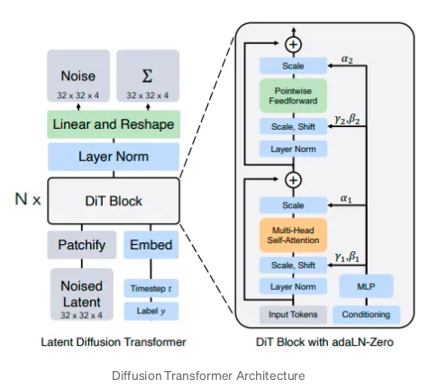

<!-- Setup -->

```{=html}
<script type="text/x-mathjax-config">
MathJax.Hub.Config({
  TeX: { 
      equationNumbers: {
            autoNumber: "all"
      } 
  }
});
</script>
```
```{r, echo=FALSE, message=FALSE}
knitr::opts_chunk$set(fig.align = 'center', message = FALSE, echo = FALSE)
#rm(list = ls()) # remove all previously stored objects (if there is any)
library(tidyverse)
library(kableExtra)
library(RColorBrewer)
library(ggplot2)
library(knitr)
library(gtools)
library(ggplot2)
library(cowplot)
library(reshape)
library(dplyr)
library(MASS)
library(reshape2)
library(directlabels)
library(readr)
library(rjags)
library(combinat)
library(coda)
library(dplyr)
library(MASS)
library(latexpdf)
library(latex2exp)
```


# Introduction

In the realm of synthesized media, recent advancements in deep generative models have ushered in a new era of creativity and realism. Techniques such as Generative Adversarial Networks (GANs), autoregressive models, flow-based models, and Variational Autoencoders (VAEs) have revolutionized image and audio synthesis [1]. Additionally, energy-based models and score matching have emerged as formidable contenders, achieving results comparable to state-of-the-art GAN-generated imagery [2]. This transformative landscape has propelled OpenAI's evolution from static image generation in DALL·E to the dynamic realm of video generation models. This reports embarks on a comprehensive exploration of the mathematical and architectural foundations that underpin this remarkable leap in generative modeling. To comprehend this rapid progression, it is crucial to establish a solid understanding of image generation. Images are envisioned as 3D matrices, with dimensions $H\times W\times C$, where $H$ denotes height, $W$ signifies width, and $C$ represents color channels. From an initial state of random noise, image generation models like DALL·E and Stable Diffusion employ Denoising Diffusion Probabilistic Models, coupled with transformers, to iteratively craft realistic and visually captivating images. Expanding upon this foundation, video generation introduces a temporal dimension, $T$, transforming the matrix into $T\times H\times W\times C$. This temporal extension introduces the complexity of motion, enabling generative models to encapsulate dynamic scenes. By blending the principles of image synthesis with temporal dynamics, video generation models unravel the secrets of animating pixels, breathing life into static canvases, and creating captivating visual narratives.

\textbf{Keywords:} Diffusion probabilistic models, Vit, random noise.

# METHODS

This section provides an introduction to diffusion probabilistic models, which are parameterized Markov chains trained using variational inference techniques. These models aim to generate samples that closely match the given data after a finite period of time. The transitions within this chain are learned in a way that reverses a diffusion process, where noise is gradually added to the data in the opposite direction of sampling until the signal is effectively destroyed. In cases where the diffusion process involves small increments of Gaussian noise, it becomes feasible to set the transitions of the sampling chain as conditional Gaussians as well. This choice allows for a particularly straightforward parameterization of the neural network [4].

```{=latex}
    \begin{figure}
        \centering
        \begin{tikzpicture}[->, >=Stealth, auto, semithick, node distance=2cm]
            \node[state] (XT) {$X_T$};
            \node[state] (Xt) [right=of XT] {$X_t$};
            \node[state] (Xtm1) [right=of Xt] {$X_{t-1}$};
            \node[state] (X0) [right=of Xtm1] {$X_0$};
            
            \path
            (XT) edge[dashed] (Xt)
            (Xt) edge[dashed] (Xtm1)
            (Xtm1) edge[dashed] (X0)
            (Xt) edge[bend left] node[above] {$p_{\theta}(x_{t-1}|x_t)$} (Xtm1)
            (Xtm1) edge[bend left,dashed] node[below] {$q(x_t|x_{t-1})$} (Xt);
        \end{tikzpicture}
        \caption{The directed graphical model}
    \end{figure}
    
```
Figure 1 represents a Markov chain process used in diffusion
probabilistic models, where $X_0$ is the original data, and $X_T$ is a
version of the data that has been completely corrupted by Gaussian noise
through a sequence of diffusion steps. Each intermediate state $X_t$
represents the data at a particular timestep during the diffusion
process. The arrows indicate the direction of the process. Starting with
the noised data $X_T$, the model learns to reverse the diffusion process
to recover the original data $X_0$. This is done by learning the
conditional distribution $p_{\theta}(X_{t-1} | X_t)$, which is the
probability of recovering the data at timestep $t-1$ given the data at
timestep $t$. This reverse process is represented by the solid arrows.
The dashed arrow represents the forward diffusion process,
$q(X_t | X_{t-1})$, which models the probability of the data at timestep
$t$ given the data at timestep $t-1$. This process gradually adds noise
to the data until it becomes completely random Gaussian noise at $X_T$.
The model is trained to match the noisy distribution at $X_T$ and learn
to reverse the process to generate samples from the learned distribution
that resemble the original data $X_0$. In the context of image
generation, the starting point $X_0$ would be a clear image, and $X_T$
would be an unrecognizable noisy version of it. The goal is to learn a
generative model that can sample from the distribution of $X_0$ by
reversing the diffusion process starting from $X_T$.

As illustrated in Figure 1, diffusion models can be characterized by the
distribution $p_\theta(\mathbf{x}_0)$, which is formalized by the
integral
$\displaystyle\int p_\theta(\mathbf{x}_{0:T}) d\mathbf{x}_{1:T}$. Here,
the variables $\mathbf{x}_1, \ldots, \mathbf{x}_T$ serve as intermediate
latent states, possessing the same dimensionality as the observed data
$\mathbf{x}_0 \sim q(\mathbf{x}_0)$. The term
$p_\theta(\mathbf{x}_{0:T})$ represents what is known as the reverse
process. This process is structured as a Markov chain initiated from a
standard Gaussian distribution
$p(\mathbf{x}_T) = \mathcal{N}(\mathbf{x}_T; \mathbf{0}, \mathbf{I})$
and progresses through transitions modeled as learned Gaussian
distributions:

$$
\begin{aligned}
p_{\theta}(\mathbf{x}_{0:T}) & := p(\mathbf{x}_T) \prod_{t=1}^T p_{\theta}(\mathbf{x}_{t-1} \mid \mathbf{x}_t) \quad \text{and} \\
p_{\theta}(\mathbf{x}_{t-1} \mid \mathbf{x}_t) & :=\mathcal{N}(\mathbf{x}_{t-1}; \mu(\mathbf{x}_t), \Sigma(\mathbf{x}_t))
\end{aligned}
$$

$q\left(\mathbf{x}_{1: T} \mid \mathbf{x}_0\right)$, called the forward
process or diffusion process, is fixed to a Markov chain that gradually
adds Gaussian noise to the data according to a variance schedule
$\beta_1, \ldots, \beta_T$ :

$$
\begin{aligned}
q\left(\mathbf{x}_{1: T} \mid \mathbf{x}_0\right)&:=\prod_{t=1}^T q\left(\mathbf{x}_t \mid \mathbf{x}_{t-1}\right)\\
q\left(\mathbf{x}_t \mid\mathbf{x}_{t-1}\right)&:=\mathcal{N}\left(\mathbf{x}_t ; \sqrt{1-\beta_t} \mathbf{x}_{t-1}, \beta_t \mathbf{I}\right)
\end{aligned}
$$

Training was performed by optimizing variational bound on negative log
likelihood:

$$
\begin{aligned}
\mathbb{E}\left[-\log p_\theta\left(\mathbf{x}_0\right)\right] &\leq \mathbb{E}_q\left[-\log \frac{p_\theta\left(\mathbf{x}_{0: T}\right)}{q\left(\mathbf{x}_{1: T} \mid \mathbf{x}_0\right)}\right]\\
&=\mathbb{E}_q\left[-\log p\left(\mathbf{x}_T\right)-\sum_{t \geq 1} \log \frac{p_\theta\left(\mathbf{x}_{t-1} \mid \mathbf{x}_t\right)}{q\left(\mathbf{x}_t \mid \mathbf{x}_{t-1}\right)}\right]\\
& =\mathbb{E}_q\left[-\log p\left(\mathbf{x}_T\right)-\sum_{t \geq 1} \log \frac{p_\theta\left(\mathbf{x}_{t-1} \mid \mathbf{x}_t\right)}{q\left(\mathbf{x}_t \mid \mathbf{x}_{t-1}\right)}\right] \\
& =\mathbb{E}_q\left[-\log p\left(\mathbf{x}_T\right)-\sum_{t>1} \log \frac{p_\theta\left(\mathbf{x}_{t-1} \mid \mathbf{x}_t\right)}{q\left(\mathbf{x}_t \mid \mathbf{x}_{t-1}\right)}-\log \frac{p_\theta\left(\mathbf{x}_0 \mid \mathbf{x}_1\right)}{q\left(\mathbf{x}_1 \mid \mathbf{x}_0\right)}\right] \\
& =\mathbb{E}_q\left[-\log p\left(\mathbf{x}_T\right)-\sum_{t>1} \log \frac{p_\theta\left(\mathbf{x}_{t-1} \mid \mathbf{x}_t\right)}{q\left(\mathbf{x}_{t-1} \mid \mathbf{x}_t, \mathbf{x}_0\right)} \cdot \frac{q\left(\mathbf{x}_{t-1} \mid \mathbf{x}_0\right)}{q\left(\mathbf{x}_t \mid \mathbf{x}_0\right)}-\log \frac{p\left(\mathbf{x}_0 \mid \mathbf{x}_1\right)}{q\left(\mathbf{x}_1 \mid \mathbf{x}_0\right)}\right] \\
& =\mathbb{E}_q\left[-\log \frac{p\left(\mathbf{x}_T\right)}{q\left(\mathbf{x}_T \mid \mathbf{x}_0\right)}-\sum_{t>1} \log \frac{p_\theta\left(\mathbf{x}_{t-1} \mid \mathbf{x}_t\right)}{q\left(\mathbf{x}_{t-1} \mid \mathbf{x}_t, \mathbf{x}_0\right)}-\log p_\theta\left(\mathbf{x}_0 \mid \mathbf{x}_1\right)\right]:=L,\quad\text{ see }[4] \text{ for details}.
\end{aligned}
$$ The design of the reverse process, specifically the adoption of
Gaussian conditional distributions in
$p_\theta(\mathbf{x}_{t-1} | \mathbf{x}_t)$, contributes to its
capability, particularly when the variances $\beta_t$ are minimal, as
both the forward and reverse processes share an analogous functional
structure in such cases [4]. An important characteristic of the forward
process is its ability to facilitate the sampling of $x_t$ at any chosen
timestep $t$ in a straightforward manner. This is achieved by defining
$\alpha_t$ as $1 - \beta_t$ and $\bar{\alpha}_t$ as the cumulative
product $\displaystyle\prod_{s=1}^t \alpha_s$, resulting in the
expression:

$$
q\left(\mathbf{x}_t \mid \mathbf{x}_0\right)=\mathcal{N}\left(\mathbf{x}_t ; \sqrt{\bar{\alpha}_t} \mathbf{x}_0,\left(1-\bar{\alpha}_t\right) \mathbf{I}\right)
$$

Optimizing the model becomes feasible through the utilization of
stochastic gradient descent, which targets random components of $L$.
Enhancements in training efficiency are achieved by diminishing
variance, accomplished by reformulating $L$:

$$
\mathbb{E}_q[\underbrace{D_{\mathrm{KL}}\left(q\left(\mathbf{x}_T \mid \mathbf{x}_0\right) \| p\left(\mathbf{x}_T\right)\right)}_{L_T}+\sum_{t>1} \underbrace{D_{\mathrm{KL}}\left(q\left(\mathbf{x}_{t-1} \mid \mathbf{x}_t, \mathbf{x}_0\right) \| p_\theta\left(\mathbf{x}_{t-1} \mid \mathbf{x}_t\right)\right)}_{L_{t-1}} \underbrace{-\log p_\theta\left(\mathbf{x}_0 \mid \mathbf{x}_1\right)}_{L_0}]
$$

Utilizing diffusion probabilistic models for video generation introduces
several complexities, including maintaining temporal coherence, managing
memory usage, avoiding representational collapse, and addressing
information redundancy. To address these issues, a transformer-based
architecture, specifically the Scalable Diffusion Models with
Transformers, has been adopted. This architecture capitalizes on the
Transformer's capabilities to execute the denoising phase within the
diffusion framework. The process aligns with the standard protocol in
diffusion models, which involves estimating the noise in an image for
the purpose of denoising. Here, the "Noised Latent" signifies the
noise-altered image, converted into a clearer, more distinct
representation. Meanwhile, "Label y" (shown figure 2) denotes any
conditional signal that might be used, varying from text to alternate
images. Furthermore, this approach incorporates a concept from StyleGAN,
utilizing AdaIN (Adaptive Instance Normalization) to facilitate the
transfer of high-level information between inputs.

{width="394"}

Although Transformers possess significant power, their inherent inefficiencies hinder direct scaling to video generation by merely expanding the temporal dimension. To address this challenge and improve efficiency in handling video content, Transformers adopt a strategy of interpreting images as sequences of patches. This approach involves restructuring the input into a one-dimensional sequence, making it compatible with the Transformer architecture. The process entails flattening the image patches into a matrix of dimensions $N \times D$, where $N$ represents the number of image patches and $D$ denotes the embedding dimension of each patch within the model, as illustrated in Figure 3. By adopting this patch-based representation, Transformers can effectively process video frames with enhanced efficiency and leverage their remarkable capabilities for generating dynamic content.

{width="400"}

In their innovative approach, the authors [3] propose extending image patches into "tubes" that span multiple frames instead of processing each frame in isolation. This strategy effectively tackles memory constraints by leveraging the typically minimal variation between consecutive frames in a video, resulting in efficient compression. By adopting this technique, they not only overcome memory challenges but also introduce modifications to handle sequence designs within a single dimension, whether it is spatial or temporal. To achieve this, the authors utilize the Self-Attention Module within a Transformer, which offers a solution to the aforementioned limitations. In their proposed method, the model separates the spatial and temporal dimensions and processes them independently across multiple heads. Attention weights are calculated distinctly for each token along both the spatial and temporal dimensions. This distinct processing is facilitated by reshaping the input sequence, enabling the necessary separation. Finally, the results from all individual heads are combined through concatenation at the final stage to form the synthesized video. This amalgamation of information from different heads allows for a comprehensive representation of the video content, incorporating both spatial and temporal aspects and resulting in a coherent and visually compelling output.

# Conclusion

Sora operates as a diffusion model that, when provided with noisy input
patches (along with conditioning data such as text prompts), is adept at
predicting the corresponding original "clean" patches. Significantly,
Sora employs a transformer-based architecture, a design renowned for its
exceptional scalability across numerous fields, encompassing language
modeling, computer vision, and image synthesis. In this report, we
discover that diffusion transformers also exhibit effective scalability
when applied to video modeling. The following section presents a
comparative analysis of video samples generated with constant seeds and
inputs over the course of training. Notably, there is a significant
enhancement in sample quality correlating with increased computational
resources allocated for training [5].


```{=tex}
\begin{thebibliography}{100}

\bibitem{} 

Generative adversarial nets,
 Goodfellow, Ian and Pouget-Abadie, Jean and Mirza, Mehdi and Xu, Bing and Warde-Farley, David and Ozair, Sherjil and Courville, Aaron and Bengio, Yoshua,
  Advances in neural information processing systems,
 27,
2014


\bibitem{}    Yilun Du and Igor Mordatch. Implicit generation and modeling with energy based models. In Advances in
Neural Information Processing Systems, pages 3603–3613, 2019.


\bibitem{} 
    Vivit: A video vision transformer,
        Arnab, Anurag and Dehghani, Mostafa and Heigold, Georg and Sun, Chen and Lu{\v{c}}i{\'c}, Mario and Schmid, Cordelia,
    Proceedings of the IEEE/CVF international conference on computer vision,
        6836--6846,
        2021

       
\bibitem{}  Denoising diffusion probabilistic models,
        Ho, Jonathan and Jain, Ajay and Abbeel, Pieter,
       Advances in neural information processing systems,
       33,
        6840--6851,
        2020
        
\bibitem{}     Chen, Mark, et al. "Generative pretraining from pixels." International conference on machine learning. PMLR, 2020.
\end{thebibliography}
```
